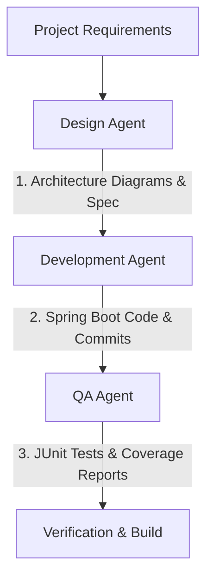

# Implementation Plan: AI-Augmented Event Ledger

This document details the implementation plan for the **Event Ledger** microservice system. The implementation will use **Spring Boot 3.x** and **Gradle** (Multi-project build), using a **hybrid AI-Augmented (Assisted + Enabled) Development** approach to showcase state-of-the-art software engineering practices.

---

## 1. AI-Augmented Development Methodology

To meet the evaluation criteria for AI-augmented software engineering, we categorize our approach into three areas:

| Approach | Definition | Application in this Project |
| :--- | :--- | :--- |
| **AI-Assisted** | Human developer paired with AI coding assistants (like Antigravity / Claude / Copilot) to accelerate coding and configuration. | We will use prompt-driven design, code generation, and configuration writing. |
| **AI-Enabled (Agentic)** | Using specialized, modular AI agent personas to automate specific SDLC phases. | We define three explicit agent personas: **Design Agent**, **Development Agent**, and **QA Agent**. Each has clear inputs, tools, and outputs. |
| **AI-Integrated (App level)** | Embedding AI capabilities (e.g., LLMs, Vector DBs) directly into the business logic. | *Excluded*: Decided to omit the optional "Smart Transaction Categorizer" to avoid external API dependencies and focus entirely on robust, resilient core distributed transaction ledger logic. |

### The Agent Personas Workflow



1. **Design Agent**: Responsible for translating the handout into technical designs, API specs, and Mermaid diagrams.
2. **Development Agent**: Responsible for code scaffolding, core logic implementation (idempotency, out-of-order processing, circuit breakers, OpenTelemetry tracing), structured logging, and creating structured git commits.
3. **QA Agent**: Responsible for test strategy, writing unit and integration tests, and validating test/functional coverage reports (JaCoCo).

---

## 2. System Architecture

```mermaid
graph TD
    Client[Browser / Client] -->|POST /events| Gateway[Event Gateway Service]
    Gateway -->|GET /events| DB_GW[(Gateway H2 DB)]
    Gateway -->|POST /accounts/{id}/transactions| Account[Account Service]
    Account -->|Update Balance| DB_ACC[(Account H2 DB)]
    
    %% Tracing & Observability %%
    Gateway -.->|OTLP/gRPC| Tempo[(Tempo - Traces)]
    Account -.->|OTLP/gRPC| Tempo
    Gateway -.->|Metrics| Prometheus[(Prometheus - Metrics)]
    Account -.->|Metrics| Prometheus
    Prometheus --> Grafana[Grafana Dashboard]
    Tempo --> Grafana
```

### Key Architectural Choices:
- **Service Isolation**: Two separate Spring Boot applications running in a Gradle multi-project setup.
- **Data Isolation**: Each service has its own in-memory **H2 database** (no shared database).
- **Communication**: Synchronous HTTP/REST communication.
- **Double-Sided Idempotency**: Both the Gateway-service (event level) and Account-service (transaction level, keying off `eventId`) enforce unique constraints to prevent duplicate processing on client and Gateway retries.
- **Combined Resiliency**: The Gateway-to-Account Service calls combine three Resilience4j patterns:
  - **Bulkhead**: Isolates the calling thread pool.
  - **Circuit Breaker**: Fails fast if the Account Service has persistent failures.
  - **Timeout & Retry**: Handles transient network/service hiccups with backoff and jitter, wrapping the target call under the circuit breaker logic.
- **Distributed Tracing**: Spring Boot 3 Micrometer Tracing with OpenTelemetry, propagating `traceparent` headers to Account Service.
- **Wiring & Dependency Injection**:
  - **Centralized Java Configuration**: Classpath auto-scanning (`@Component`/`@Service` annotations) will be minimized. Instead, bean wiring will be managed from a central Java `@Configuration` class (`AppConfig.java`) in each module using explicit `@Bean` methods.
  - **Constructor Injection**: All beans will use constructor injection to wire dependencies, avoiding field-based `@Autowired` injection and ensuring easy instance creation in unit tests.
  - **Interface-Driven & Composition**: Define clear Java interfaces for all business services (e.g. `EventService`, `TransactionService`, `IdempotencyVerifier`), implementing them cleanly with composition to make mocking and unit testing simple. Proper `@Qualifier` annotations will be used where multiple implementations exist.

---

## 3. Step-by-Step Implementation Plan

### Phase 1: Architecture & Contract Definition (Design Agent)
- [ ] Create `design_document.md` detailing API schemas, database schemas, trace propagation protocol, and resilience state transitions.
- [ ] Generate Mermaid design diagrams.

### Phase 2: Project Setup & Gradle Scaffolding
- [ ] Initialize a Gradle multi-project repository:
  - `settings.gradle`: Define `:gateway-service`, `:account-service`, and `:common` modules.
  - Root `build.gradle`: Configure common plugins (Java 17+, Spring Boot, Dependency Management, JaCoCo).
  - Scaffolding folders and packages for both services.

### Phase 3: Core Implementation (Development Agent)
- [ ] **Common Module**:
  - DTOs (EventPayload, TransactionRequest, AccountBalanceResponse).
  - Custom Tracing filter/interceptor to log trace IDs.
  - **Spring AOP Aspects**: Create custom annotations (`@TrackExecutionTime` for latency metrics, `@AuditedTransaction` for audit logging) and their corresponding aspects to selectively handle cross-cutting telemetry.
- [ ] **Event Gateway Service**:
  - Controller with `/events` endpoints.
  - Idempotency logic: Save events to Gateway H2 DB. If event ID exists, return existing event (HTTP 200/209) without calling Account Service.
  - RestClient configuration with Resilience4j (Circuit Breaker, Bulkhead, and Timeout/Retry with backoff & jitter) that attaches the internal M2M Bearer token.
  - Graceful degradation: Check circuit breaker/bulkhead/retry/health state. Return HTTP 503 if Account Service is unreachable on POST.
  - Spring Security configuration with local JWT verification (using HMAC/symmetric key validation), excluding `/health`, `/actuator/**`, and a mock `/auth/token` token-generation endpoint.
  - **Global Exception Handler (`@RestControllerAdvice`)**: Standardized error responses (RFC 7807) mapping validation, duplicate events, and Resilience4j exceptions (Circuit Breaker, Bulkhead, Timeouts) to their respective HTTP status codes, returning the current `trace_id` to the client.
- [ ] **Account Service**:
  - Transaction processing logic.
  - **Out-of-order tolerance logic**: 
    - Store all processed transactions with their original `eventTimestamp`.
    - Balance is calculated dynamically by sorting all events chronologically (sum of Credits - sum of Debits).
  - Controller with `/accounts/...` endpoints.
  - Spring Security configuration enforcing a shared M2M Bearer token in the `Authorization` header for all write and read requests.
  - **Global Exception Handler (`@RestControllerAdvice`)**: Standardized error handler translating internal validation, database constraints (idempotency violations), and processing errors.
- [ ] **Observability & Logging**:
  - Configure Logback to output JSON formatted logs containing `trace_id` and `span_id`.
  - Add Prometheus actuator metrics endpoint.
  - Custom Metric: Count of processed events vs failed events.

### Phase 4: Automated Testing & QA (QA Agent)
- [ ] Write unit tests covering business logic (idempotency checks, out-of-order balance calculation, field validation rules).
- [ ] Write API and functional integration tests using **REST Assured**:
  - Verify edge security (validating JWT tokens and rejecting unauthorized requests).
  - Verify idempotency behavior (sending duplicate events and asserting cached response payload/headers).
  - Verify internal M2M security (verifying gateway calls are signed, and unauthorized internal calls are rejected).
  - Verify trace header propagation (`traceparent`) from Gateway to Account Service.
- [ ] Write End-to-End and Integration tests using **k6** (Javascript script):
  - Simulate multiple concurrent upstream clients submitting transactions.
  - Verify that high concurrency and service slowness triggers the combined Bulkhead and Circuit Breaker states, returning proper 429/503 errors.
  - Verify system recovery and auto-healing behavior when the Account Service recovers.
- [ ] Configure JaCoCo code coverage plugin and verify coverage metrics.

### Phase 5: Containerization, Auto-Healing & Diagnostic Logging
- [ ] Write Dockerfiles for both services:
  - Add JVM crash parameters (`-XX:+HeapDumpOnOutOfMemoryError` and `-XX:HeapDumpPath=/var/log/dumps`) to capture memory crash details.
- [ ] Create `docker-compose.yml` including:
  - `gateway-service` (configured with `restart: always` and a Docker `healthcheck` querying `/actuator/health`)
  - `account-service` (configured with `restart: always` and a Docker `healthcheck` querying `/actuator/health`)
  - `tempo` (for trace storage)
  - `prometheus` (for metric collection)
  - `loki` & `promtail` (to aggregate container stdout/stderr logs so pre-crash logs/exceptions are preserved)
  - `mailpit` (mock SMTP server to capture Grafana email alerts locally)
  - `grafana` (unified dashboard to view metrics, query traces, inspect logs, and dispatch mail alerts to Mailpit)
- [ ] Configure Grafana Alerting (e.g., alert on service down via `up == 0`, container restart count, or open Circuit Breaker) using Grafana YAML provisioning.

### Phase 6: AIOps Diagnostic & Self-Healing Agent (Bonus/Agentic)
- [ ] Create a local `/aiops-agent` Python component:
  - Implement a listener script that accepts Grafana Alert webhooks.
  - Implement Loki & Tempo API clients to retrieve logs/traces around alert timestamps.
  - Set up a simple markdown-based RAG directory (`docs/post-mortems/`) containing past failure patterns and remediation strategies.
  - Integrate an LLM reasoning prompt to analyze the telemetry against retrieved RAG items.
  - Implement a script to auto-generate configuration changes (e.g., modifying `application.yml` parameters) or create a regression integration test in JUnit based on the failure context.

---

## 4. Discussion on AI-Augmented Software Engineering

For your submission, we will document the "how" along with the "what". 
We will structure our work in Git using clean, logical commits, tagging each commit or phase with the agent persona that drove it:
* `[design-agent] ...`
* `[dev-agent] ...`
* `[qa-agent] ...`

This makes your git history a direct artifact of AI-augmented software engineering.
