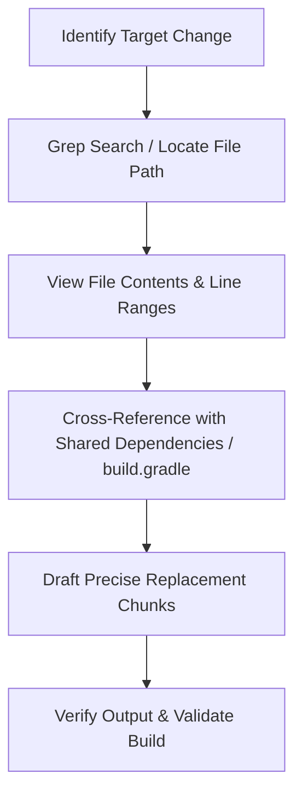

# Anti-Hallucination & Local Context Navigation Skill

This skill documents the rules and workflow patterns that agents must follow to eliminate hallucinations, prevent API mismatches, and ensure code modifications are strictly aligned with the repository's actual implementation.

---

## 🚫 Anti-Hallucination Safeguards

AI models can occasionally hallucinate API parameters, file structures, library methods, or system configurations. To guarantee high accuracy, enforce the following rules:

### 1. The Code is the Source of Truth (No Guessing)
* **API Signatures**: Never guess or assume HTTP endpoints, query parameters, payload structures, or method signatures.
  * *Pattern*: Always locate the concrete controller or client class (e.g., [AccountClientImpl.java](file:///home/ajayraja/workarea/projects/event-ledger-ai-enabled/gateway-service/src/main/java/com/ledger/gateway/service/AccountClientImpl.java)) and read the exact implementation details before drafting edits.
* **Imports & Dependencies**: Never invent package structures or library dependencies. Check [build.gradle](file:///home/ajayraja/workarea/projects/event-ledger-ai-enabled/build.gradle) first to see which libraries are actually available (e.g., check Resilience4j versions, Spring Boot versions).

### 2. Read Before Write (Anchor Context First)
* Before editing any line of code in any file, you must **view the target file** using search or file viewing tools.
* Do not attempt to use regex replaces or line-based edits without first loading the context of that exact file range into memory.

---

## 🧭 Repository Context Exploration Patterns

To maintain a targeted and focused execution flow, use these step-by-step navigation techniques:

### Pattern A: Tracking DTO and Schema Alignment
When updating or adding API fields, ensure the gateway and account services are aligned:
1. Locate the request/response DTO in the Gateway service.
2. Locate the corresponding DTO or Database Entity in the Account service.
3. Verify that types, formats (like ISO timestamps), and field names match exactly.

### Pattern B: Port & Property Verification
Do not assume standard Spring Boot configurations or credentials:
1. Check the local `application.yml` or `application.properties` files in the specific service resource directories (e.g., `src/main/resources/application.yml`).
2. Confirm the server port (e.g., `8080` vs `8081`) and database configuration (e.g., H2 console settings) before writing connection utilities.

---

## 🔍 Context Appending Workflow for Edits

Follow this procedure for every targeted edit:

1. **Locate**: Use `grep_search` to find instances of classes, variables, or functions related to the target feature.
2. **Context-Check**: Read the surrounding 50-80 lines of the target file to understand local variable scope and code formatting style.
3. **Align**: Verify if the target file references classes defined in other modules (e.g., `common`). If so, read those common files too.
4. **Targeted Edit**: Apply your changes using the narrowest possible chunk replacement range to avoid overwriting unrelated code.
