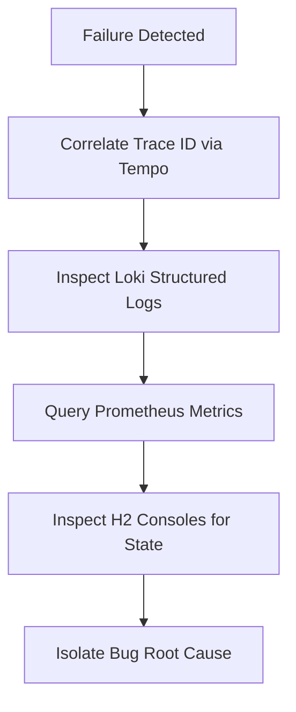

# Root Cause Analysis & System Hardening Skill

This skill outlines how agents must diagnose system failures, triage errors to the correct testing tier (unit, integration, or end-to-end), and write regression tests to harden the system against future edge cases or race conditions.

---

## 🔍 Root Cause Analysis (RCA) Workflow

When a test fails, or an incident occurs locally/in production, follow this diagnostic sequence:

1. **Trace ID Correlation**: Extract the `trace_id` from the error response or system logs and locate the trace span flow in Grafana Tempo.
2. **Log Inspection**: Fetch structured JSON logs from Loki corresponding to the active `traceId` and `spanId`. Look for exceptions, MDC context values, or database constraint failures.
3. **Metric Analysis**: Verify system metrics (e.g., active thread counts in Tomcat, bulkhead queue usage, or circuit breaker states).
4. **State Verification**: Query H2 databases (`gatewaydb` / `accountdb`) using `/h2-console` to inspect active table states and check if transaction rows conform to expectations.

---

## 🛠️ Failure Triage & Test Scope Classification

Once the root cause is identified, triage the bug to the correct testing tier to prevent regression:

### 1. Unit Tests
* **Target**: Isolated logical checks, edge cases, validation formulas, or DTO conversion behaviors.
* **Scope**: Quick execution without loading Spring application contexts.
* **Example**: Verifying negative amounts or empty transaction payloads throw a `MethodArgumentNotValidException`.

### 2. Integration Tests
* **Target**: Service layers interacting with databases, ORMs, aspects, or network clients.
* **Scope**: Uses `@SpringBootTest` or `@DataJpaTest` with test containers or in-memory databases.
* **Example**: Testing double-sided idempotency. Validating that concurrent database insertions of identical `eventId`s trigger a constraint violation and yield a `209 Conflict`.

### 3. End-to-End (E2E) & Resiliency Tests
* **Target**: Multi-hop service operations, trace propagation headers, race conditions, timeout thresholds, and resilience configurations.
* **Scope**: Spinning up both services (`gateway-service` and `account-service`) or using MockMvc to check API routing, distributed spans, and fallback mechanics.
* **Example**: Simulating slow downstream responses to verify that the Circuit Breaker opens after 10 requests and that the Bulkhead rejects incoming requests after reaching maximum capacity.

---

## 🛡️ System Hardening & Mitigation Checklist

To harden the system over time against verified failures, apply these design updates:

* **Race Conditions**: Enforce database unique constraints on idempotency keys (`eventId` in `transactions`) rather than relying solely on read-before-write checks.
* **Transient Network Blips**: Adjust Resilience4j retry config with exponential backoff and jitter to absorb network flakiness.
* **Thread Exhaustion**: Fine-tune Bulkhead queue sizes and core/max pool sizes to match actual traffic patterns.
* **Error Transparency**: Standardize exception handlers to report clear, traceable, and RFC-compliant error details.
